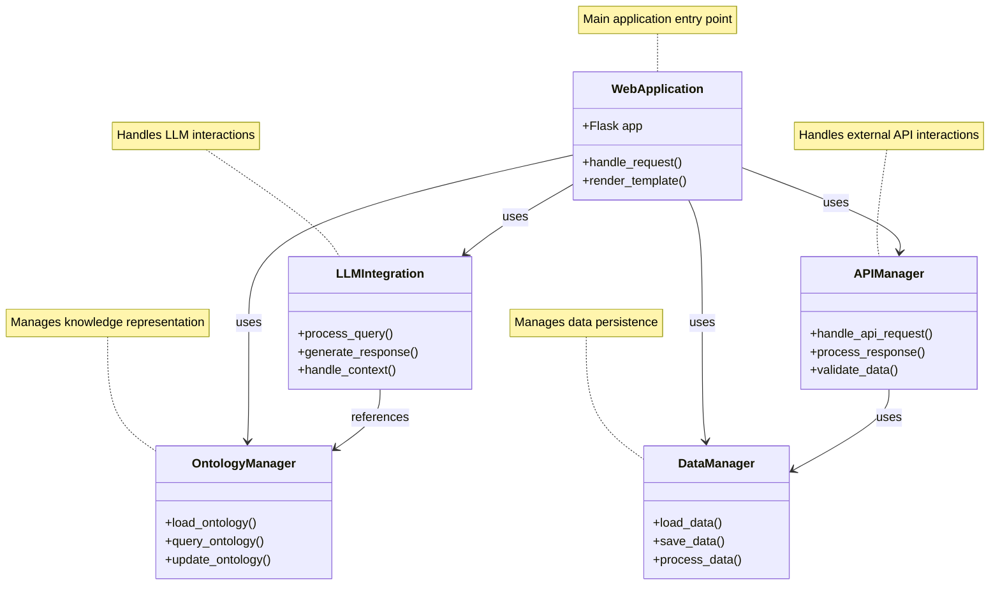

## UML Diagram Explanation

This UML Class Diagram represents the high-level architecture of the system with the following components:

1. **WebApplication**: The main Flask application that serves as the entry point for the system.
2. **LLMIntegration**: Handles all interactions with the Language Model.
3. **OntologyManager**: Manages the knowledge representation and ontology operations.
4. **APIManager**: Handles external API interactions and data processing.
5. **DataManager**: Manages data persistence and processing.

The arrows indicate relationships between components:

- Solid arrows show direct dependencies
- Each component has its key methods listed
- Notes provide additional context for each component

This diagram helps visualize:

- The modular nature of the system
- How different components interact
- The flow of data and control
- The separation of concerns between different modules
